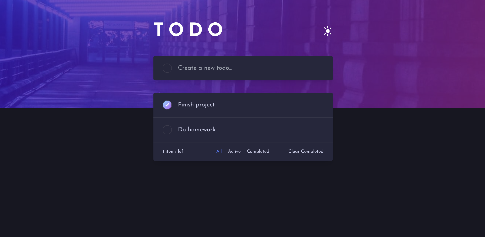

# Analog App

This is a solution to the [Todo app challenge on Frontend Mentor](https://www.frontendmentor.io/challenges/todo-app-Su1_KokOW). Frontend Mentor challenges help you improve your coding skills by building realistic projects.

This project was generated with [Analog](https://analogjs.org), the fullstack meta-framework for Angular.

## The challenge

Your challenge is to build out this todo app and get it looking as close to the design as possible.

You can use any tools you like to help you complete the challenge. So if you've got something you'd like to practice, feel free to give it a go.

Your users should be able to:

- View the optimal layout for the app depending on their device's screen size
- See hover states for all interactive elements on the page
- Add new todos to the list
- Mark todos as complete
- Delete todos from the list
- Filter by all/active/complete todos
- Clear all completed todos
- Toggle light and dark mode
- **Bonus**: Drag and drop to reorder items on the list

Want some support on the challenge? [Join our community](https://www.frontendmentor.io/community) and ask questions in the **#help** channel.

# Note to self

At this point in time the @prisma/client doesn't seem to play nice with pnpm, hence I switched to npm.

https://github.com/prisma/prisma/discussions/12501

## Setup

Run `npm install` to install the application dependencies.

## Development

Run `npm start` for a dev server. Navigate to `http://localhost:5173/`. The application automatically reloads if you change any of the source files.

## Build

Run `npm run build` to build the client/server project. The client build artifacts are located in the `dist/analog/public` directory. The server for the API build artifacts are located in the `dist/analog/server` directory.
